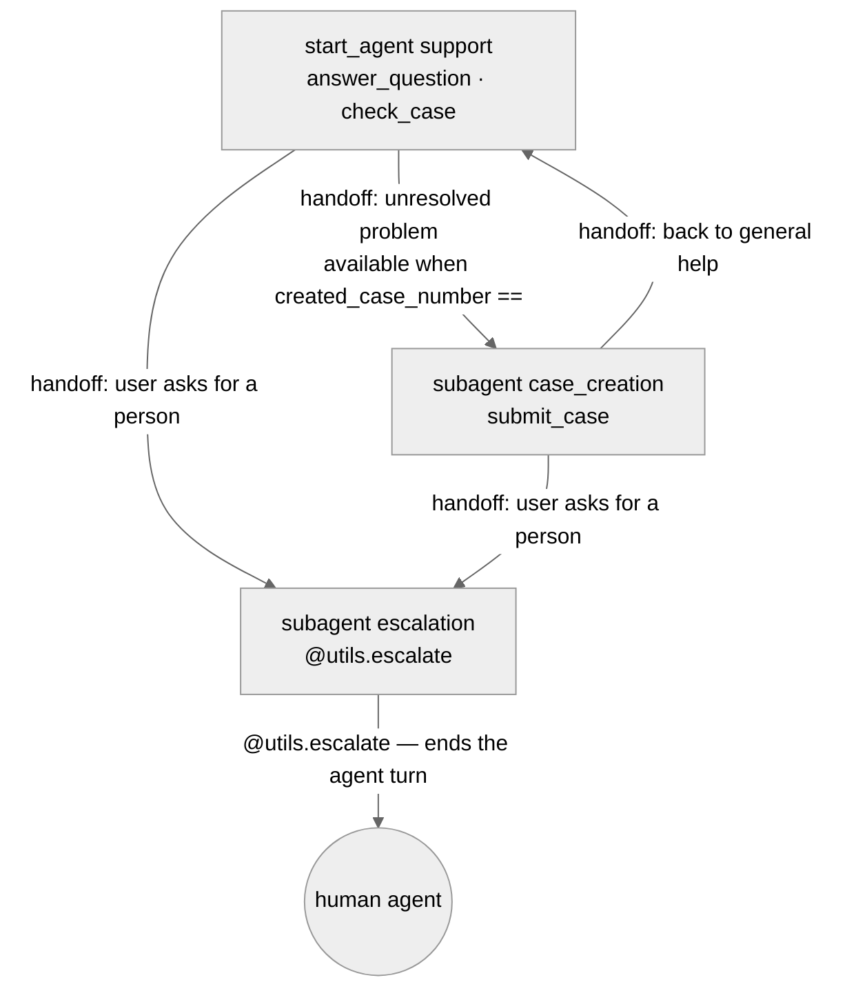

# Agent Spec: Cascade_Service_Agent

**Status:** Draft scaffold — 2026-09-17. Not yet reviewed or approved.
**Bundle:** `force-app/main/default/aiAuthoringBundles/Cascade_Service_Agent/`

## Purpose & Scope

A customer-facing Agentforce Service Agent that deflects common support contacts:
answers general questions from the knowledge base, reports the status of a case
the user already has, and logs a new case when it cannot resolve the request.
Anything it cannot handle goes to a human.

Scope is deliberately generic. The knowledge domain, case fields, and routing
rules are placeholders to be replaced with the real requirements.

## Behavioral Intent

- The agent answers **only** from action output. It must not state a case
  number, status, or date that an action did not return. This is enforced in the
  global `system.instructions` and repeated as a response duty in the `support`
  block.
- Knowledge answers are reproduced verbatim (`answer`, `articleTitle`,
  `articleUrl`). Paraphrasing risks failing platform grounding validation.
- Exactly one case may be created per conversation. Repeat creation is blocked
  by a runtime gate, not by instruction text.
- Off-topic requests and ambiguous requests are handled as **branches** inside
  the `support` block, not as separate subagents. Neither changes the available
  action set or authority, so neither earns its own scope.
- Escalation is a separate subagent because it changes authority — it ends the
  agent's turn and hands control to a human.
- Action implementation type: invocable Apex for all three actions.

## Subagent Posture

| Subagent | Posture | Why this posture | Deterministic controls |
|---|---|---|---|
| `support` | agentic | One domain, one action set. The model judges question vs. case-status vs. new-problem from conversation; none of those branches is trust- or policy-sensitive. | `log_a_case` hidden once a case exists |
| `case_creation` | mixed | Collecting subject and description is ordinary conversation, but the write itself is consequential and irreversible. | `submit_case` gated on no existing case; `require_user_confirmation: True` |
| `escalation` | scripted | Single duty, single action, no judgment required. | none |

## Subagent Map

All transitions are **handoffs**. There is no delegation and no return stack.

## Variables

| Variable | Type / Default | Trusted Writer | Named Consumer | Cause | Reset / Expiry / Correction / Cancel |
|---|---|---|---|---|---|
| `created_case_number` | `mutable string = ""` | `create_case` output `caseNumber` | `available when` on `submit_case` and `log_a_case`; conditional instruction branches in all three subagents | Confirmed consequence — a second call creates a duplicate Case record | Never reset. A session creates at most one case, so the set-once lifetime is the whole lifecycle. |

`EndUserId`, `RoutableId`, `ContactId`, and `EndUserLanguage` are platform-linked
messaging variables. `ContactId` is consumed as an action input; the other three
are unused by this agent but the compiler flags them as required by Agentforce —
do not remove them.

No other state. The user's question, their stated problem, prior corrections,
and current intent all live in surviving conversation history.

## Actions

### AnswerQuestionsWithKnowledge (`support` subagent)

- **Target:** `standardInvocableAction://streamKnowledgeSearch` (platform-native, Agentforce Data Library grounding)
- **Status:** DRAFTED — 2026-09-17. `rag_feature_config_id` is a `[TBD]` placeholder pending ADL provisioning; not yet functional.
- **Supersedes:** the custom `search_knowledge` action (`apex://CascadeKnowledgeSearch`), removed from the `.agent` file. See "Why this replaced the Apex approach" below.

| Input | Type | Required | Source |
|---|---|---|---|
| `query` | string | Yes | LLM slot-fill from conversation |
| `citationsUrl` | string | No | Bound from top-level `@knowledge.citations_url` |
| `ragFeatureConfigId` | string | No | Bound from top-level `@knowledge.rag_feature_config_id` |
| `citationsEnabled` | boolean | No | Bound from top-level `@knowledge.citations_enabled` |

| Output | Type | Visible to User? | Notes |
|---|---|---|---|
| `knowledgeSummary` | object (rich text) | Yes | Reproduced verbatim; empty means retrieval missed |
| `citationSources` | object | No | Source links for the planner's hydrated prompt |

**Why this replaced the Apex approach:** live-preview testing on 2026-09-17
found that `CascadeKnowledgeSearch.cls`'s direct SOSL query against
`Knowledge__kav` always returned zero rows for the running agent, because
Salesforce Knowledge object access is gated by the `Knowledge User` user
permission, and the `Einstein Agent` User License — which `default_agent_user`
is required to hold — does not support that permission on this org
(`FIELD_INTEGRITY_EXCEPTION: Knowledge User is not allowed for this License
Type`, confirmed via direct API test). No choice of `default_agent_user` fixes
this; it's a platform license constraint, not a permissions gap. Grounding via
an Agentforce Data Library sidesteps it — the retriever queries a Data Cloud
copy of the article content, which needs only ordinary object/field Read via a
permission set, not the license-gated `Knowledge User` bit (see the
agentforce-generate skill's Data Library reference, "Wiring the ADL into
Agent Script" section 5b).

**Provisioning still required (not yet done — needs confirmation before an org
change):**
1. Create a `KNOWLEDGE`-source-type ADL (`sf agent adl create --source-type knowledge --primary-index-field1 ArticleNumber --primary-index-field2 Title --content-fields Summary`) against the 5 seeded Cascade support articles.
2. Poll to `retrieverId` populated, then wait ~10 min and verify non-empty `knowledgeSummary` on a test query (KNOWLEDGE libraries have a day-0 chunking race condition — `retrieverId` alone does not mean ready).
3. Set `knowledge.rag_feature_config_id` in the `.agent` file to `"ARFPC_<libraryId>"`, replacing the `[TBD]` placeholder.
4. Deploy a permission set granting the Einstein Agent User Object Read on `Knowledge__kav` and Field Read on the indexed fields, and confirm it also holds a Data Cloud permset/PSL (required for any ADL-grounded retrieval, independent of source type).
5. Confirm article `Language` (`en_US`) matches the agent's `EndUserLanguage` / default locale — a mismatch silently excludes chunks at query time.
6. Re-run live preview with the same "How do I reset my password?" utterance and confirm a populated, non-hallucinated answer.

Until steps 1–4 complete, `answer_question` will behave like the old broken
action (empty result, "I couldn't find an answer" branch) — the `.agent` file
change alone does not fix retrieval.

### get_case_status (`support` subagent)

- **Target:** `apex://CascadeCaseStatusLookup`
- **Status:** NEEDS STUB

| Input | Type | Required | Source |
|---|---|---|---|
| `caseNumber` | string | Yes | LLM slot-fill |
| `contactId` | string | No | Bound from `@variables.ContactId` |

| Output | Type | Visible to User? | Notes |
|---|---|---|---|
| `status` | string | Yes | |
| `subject` | string | Yes | |
| `lastModified` | string | Yes | String, not datetime, so it can be reproduced verbatim without reformatting |
| `found` | boolean | No | Signals the "no such case" branch |

**Stubbing requirement:** query `Case` by `CaseNumber` **and** `ContactId` so a
user cannot read another customer's case by guessing a number. Bulkified SOQL,
`AccessLevel.USER_MODE`.

### create_case (`case_creation` subagent)

- **Target:** `apex://CascadeCaseCreator`
- **Status:** NEEDS STUB

| Input | Type | Required | Source |
|---|---|---|---|
| `subject` | string | Yes | LLM slot-fill |
| `problemDescription` | string | Yes | LLM slot-fill |
| `contactId` | string | No | Bound from `@variables.ContactId` |

| Output | Type | Visible to User? | Notes |
|---|---|---|---|
| `caseNumber` | string | Yes | Written to `created_case_number` |
| `caseId` | string | No | Record ID, internal |

**Stubbing requirement:** insert a `Case` with Origin set to the messaging
channel. Named `problemDescription` rather than `description` to avoid colliding
with the reserved `description` property in the Agent Script action block.

## Action Invocation Strategy

| Action | Subagent | Invocation Mode | Why |
|---|---|---|---|
| `AnswerQuestionsWithKnowledge` | `support` | planner slot-fill | The model judges when a question is answerable from knowledge |
| `get_case_status` | `support` | planner slot-fill | Requires a case number the user supplies mid-conversation |
| `create_case` | `case_creation` | planner slot-fill + `require_user_confirmation` | Consequential write; the user confirms before it fires |

No `run` (deterministic) invocation. Nothing here must fire on every entry.

## Deterministic Controls

- `submit_case` visibility: `available when @variables.created_case_number == ""`
  — cause is confirmed consequence (duplicate Case records). Trusted writer is
  the action's own `caseNumber` output, so the gate closes the moment the write
  succeeds.
- `log_a_case` transition visibility: same condition, so the model cannot even
  route back into case creation after a case exists.
- `create_case` carries `require_user_confirmation: True` — platform-level
  confirmation in front of the write, independent of instruction text.

## Architecture Pattern

Domain-first, not router-first. `start_agent support` is the entry point and
does the real work; there is no classifier block in front of it. Two boundaries
are justified:

- `case_creation` — different action set, consequential authority, and its own
  confirmation posture.
- `escalation` — different authority; `@utils.escalate` ends the agent's turn.

Greeting, off-topic redirect, ambiguity clarification, and "no answer found" are
branches inside `support`, per the one-execution-block default.

## Agent Configuration

- **developer_name:** `Cascade_Service_Agent`
- **agent_label:** `Cascade Service Agent`
- **agent_type:** `AgentforceServiceAgent` — customer-facing over a messaging
  channel, with `MessagingSession`-linked variables.
- **access.default_agent_user:** **`"NEW AGENT USER"` — PLACEHOLDER, NOT VALID.**
  Must be replaced with the username of an active user holding an Einstein Agent
  license in the target org. Publishing with the placeholder fails with a
  misleading `Internal Error, try again later`.
- **Target org:** none set. The project has no org association; validation so far
  is local compile only.
- **Permissions verified:** no.

## Open Items

1. ~~Choose the target org and confirm an Einstein Agent User exists in it.~~
   Done — `cascade-dev`, `Cascade_Service_Agent_agent@00Dak00001FNjPtEAL.ext`.
2. Provision the KNOWLEDGE-source ADL and wire its `rag_feature_config_id` into
   the `.agent` file's `knowledge:` block — see `AnswerQuestionsWithKnowledge`
   provisioning checklist above. Needs explicit confirmation before the org
   changes (ADL creation, permission set deploy) run.
3. Decide whether to delete the now-unreferenced `CascadeKnowledgeSearch.cls`,
   or keep it until the ADL path is verified working end-to-end.
4. Replace the generic support domain with Cascade's actual use cases.
5. Re-run live preview against "How do I reset my password?" once ADL
   provisioning completes, to confirm the license-gated failure is actually
   resolved.
